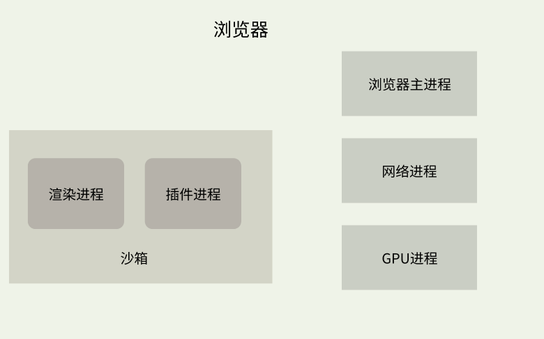
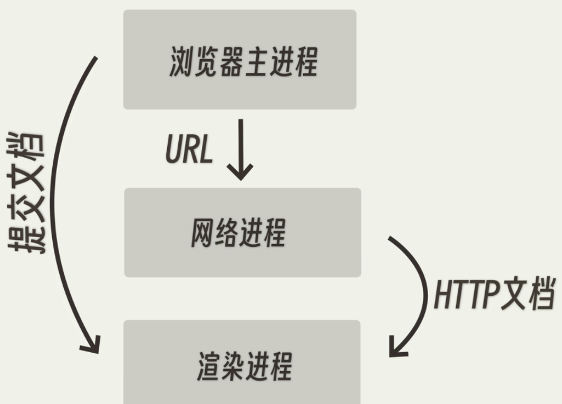
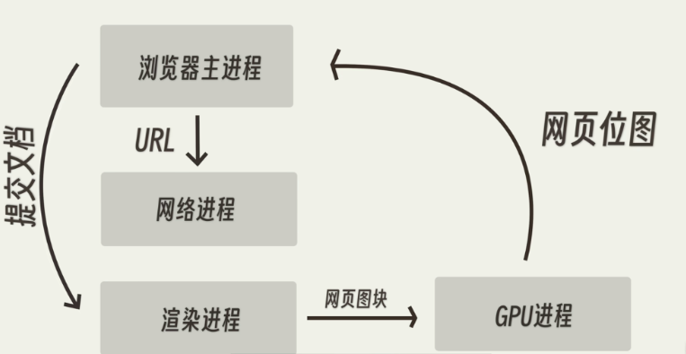
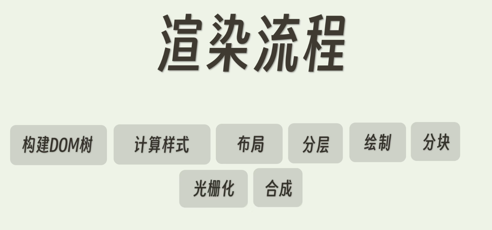
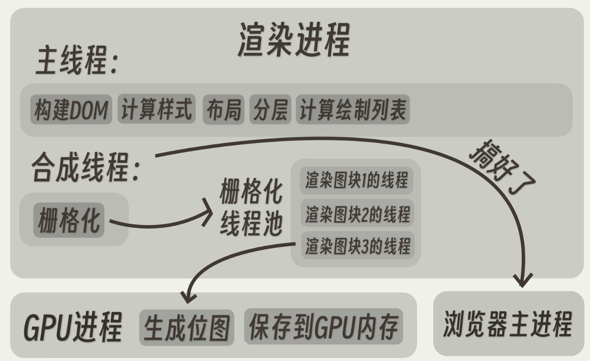
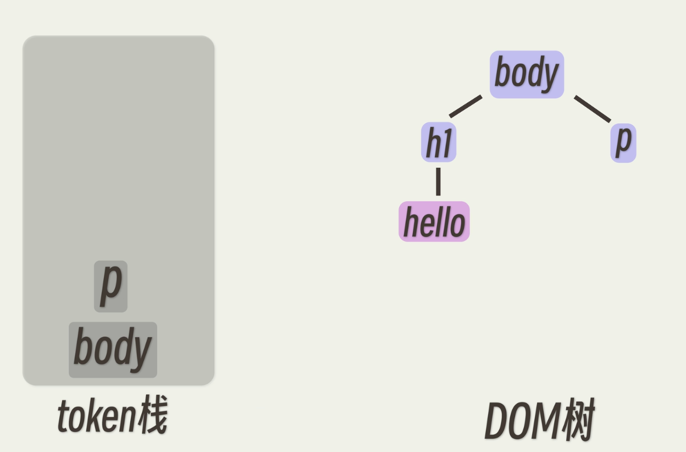
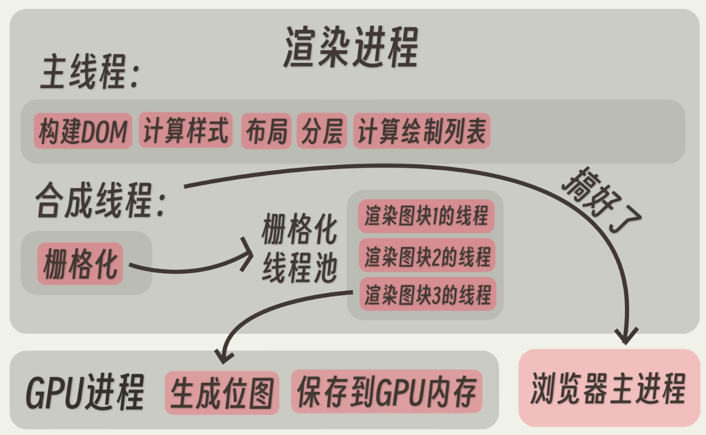
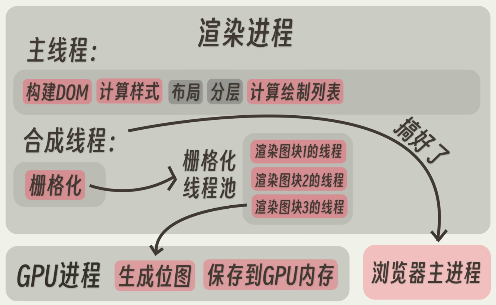
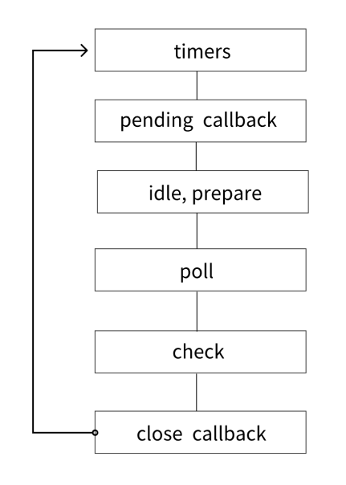
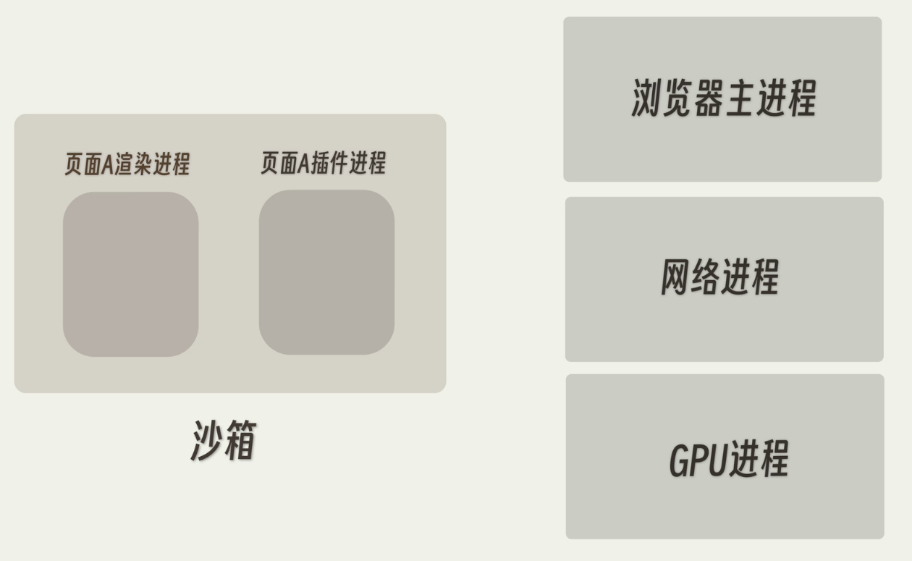

> 本篇文章基于 Chrome 浏览器阐述浏览器的工作原理

### 浏览器架构

Chrome 采用**多进程架构**，主要包括五种进程：浏览器主进程、渲染进程、网络进程、GPU 进程和插件进程。这种多进程架构的设计有助于提高浏览器的稳定性和性能。每个进程相互隔离，一个进程出现问题不会影响到其他进程，同时可以利用多核 CPU 和操作系统的并发执行能力实现并发处理，提高整体性能。同时有助于实现更好的安全性，通过沙箱机制可以限制进程对系统资源的访问，防止恶意代码对系统造成危害。



- **主进程**：负责协调、控制其他进程，管理用户界面、子进程和插件，以及处理用户输入和浏览器整体的功能，如地址栏、书签等。
- **渲染进程(内核进程)**：负责加载和渲染网页内容、执行 JavaScript 代码，每个标签页或者独立的浏览器窗口通常都有一个渲染进程。
- **GPU 进程**：负责处理浏览器中的图形操作和 GPU 加速任务，例如页面的绘制、动画和 3D 渲染等。
  > **GPU**：Graphics Processing Unit，图形处理单元，专门用于处理图形和图像计算的硬件设备，它可以高效地执行诸如渲染、图形加速、图像处理和计算等任务。
- **网络进程**：负责处理浏览器中的网络请求和响应，包括下载网页和资源。
- **插件进程**：负责浏览器插件的运行。

### 浏览器内核进程-渲染进程

渲染进程通常有五类线程：GUI 渲染线程、JS 引擎线程、事件触发线程、定时器触发线程和异步 HTTP 请求线程。

- GUI 渲染线程：负责渲染网页。
- JS 引擎线程：负责处理 JavaScript 脚本程序。
  > GUI 渲染线程与 JS 引擎线程是互斥的，当 JS 引擎执行时 GUI 线程会被挂起。
- 事件触发线程：负责处理用户输入、触发事件。它管理着一个事件队列，当事件被触发时添加到事件队列中，等待 JS 引擎的处理。
- 定时器触发线程：负责处理 setTimeout 和 setInterval 等方法设置的定时器，触发相应的回调函数。
- 异步 HTTP 请求线程：处理 JavaScript 层面的异步网络请求，如 XMLHttpRequest、fetch 等。

**异步 HTTP 请求线程和网络进程的区别**

异步 HTTP 请求线程是专门用来处理 JavaScript 层面的异步网络请求的，例如使用 XMLHttpRequest 对象、fetch API 等。

网络进程负责所有的网络操作，包括页面导航、处理页面请求、资源加载等。

### 网络进程

网络进程主要负责处理网络请求、执行 DNS 解析、建立网络连接、处理缓存、与其它进程进行通信，通常有以下几种进程：

- DNS 解析线程：负责 DNS 解析。
- SSL 线程：处理加密通信，建立 SSL/TLS 连接。
- 网络请求线程：处理网络请求和响应，接收和发送数据。
- IPC 线程：负责进程间通信。

## 核心问题：在浏览器中，从输入 URL 到页面展示发生了什么？

1. 浏览器的主进程通过 IPC 把 URL 发送给网络进程，开始转圈 loading…，此时页面还没有发生变化
2. 网络进程接收到 URL 后，先检查有无缓存，有则直接返回并中断请求，如果没有缓存：

   1. 向 DNS 服务器发送请求，获取对应 IP 地址
   2. 建立 TCP/IP 连接，若传输协议为 https，还需要建立 TLS 连接
   3. 浏览器构建请求发送给服务器
   4. 服务器收到请求后生成响应的数据并返回给网络进程
   5. 网络进程收到响应头后开始解析


3. 主进程开启渲染进程，并发送一个提交文档的命令到网络进程，渲染进程与网络进程间开启 IPC 进行数据传输，渲染进程读取网络进程收到的 HTTP 响应体中的信息进行渲染，接收完毕后发送完成指令到主进程，主进程收到后浏览器页面变为白屏



4. 渲染进程开启渲染流程，联合 GPU 进程进行渲染页面，渲染完毕后将页面返回给主进程进行展示



## 浏览器的渲染流程

构建 DOM 树—>计算样式—>布局—>分层—>绘制—>分块—>光栅化—>合成



**渲染进程：**



1. 构建 DOM 树

   通过 HTML 解析器构建 DOM 树，使用分词器把开始标签、内容和结束标签识别并分开形成 token，然后将 token 转化为 DOM 节点并添加到 DOM 树中。DOM 树描述的是 HTML 标签之间的层级关系。

   > token 使用 **token 栈** 进行存储，token 入栈，遇到结束标签的 token 时将其开始标签及内容出栈放到 DOM 树中，节点构建完成。

   > 遇到 script 标签时，暂停解析，因为 script 标签中的内容可能会改变 DOM 树的结构，等到脚本执行完毕后再继续解析。



2. 计算样式，构建 CSSOM 树。

   1. 将样式表中的属性进行标准化处理(如将 em、blue、bold 等值转化为 px、rgb、700)。
   2. 根据**继承规则**和**层叠规则**计算 DOM 树中每个节点的样式属性。

   > 层叠规则：层叠规则定义了如何合并来自多个源的属性值的算法。

   > CSSOM 树描述的是选择器之间的层级关系，与 DOM 不是一一对应的关系。

   > CSS 样式来源：link 标签引入外部 css 样式文件、style 标签内的 css 样式、内联样式。

   > CSSOM 树的作用：为渲染树的合成提供样式信息、为 JavaScript 提供操作样式的能力。

<a href="https://developer.mozilla.org/zh-CN/docs/Learn/CSS/Building_blocks/Cascade_and_inheritance" target="_blank">MDN 文章-层叠、优先级与继承</a>

3. 布局

   主线程遍历 DOM 及相关元素的计算样式，构建出包含每个元素的页面坐标信息及盒子模型大小的布局树(Render Tree)，遍历过程中会跳过隐藏的元素(display:none)。

4. 分层

   页面中有很多复杂的效果，像是 3D 变换、页面滚动、z-index 等，为了更方便的实现这些效果，渲染引擎会为特定的节点生成专用的图层，并生成一颗对应的图层树。

   > 满足以下条件之一的元素会被提升为单独的一个图层：
   > a. 拥有层叠上下文属性的元素：如设置了 position、z-index、filter、opacity 相关属性值的元素。
   > b. 需要剪裁的地方：超过视图范围的文字、overflow 设置为 hidden 或 auto。

5. 绘制

   渲染引擎对图层树中的每个图层进行绘制，生成绘制列表(包含元素绘制顺序等信息)，提交到合成线程。

6. 分块

   合成线程将图层划分为图块，大小通常为 256x256 或者 512x512。

7. 光栅化

   将图块转换为像素图像，合成线程会优先将视口附近的图块生成位图。

8. 将不同的图层按照正确的顺序绘制到屏幕上，合成为最终的屏幕图像。

      > 合成线程拿到所有位图后，生成一个个指引(quad)信息，然后提交给GPU进程，GPU进程根据这些指引信息合成图像。

### 重排、重绘

**重排**：当DOM的变化影响了元素的几何信息(元素的的位置和尺寸大小)，浏览器需要重新计算元素的几何属性，将其安放在界面中的正确位置，这个过程叫做重排。

所有流程都得跑一遍：



会导致重排的情况：

- 页面初始渲染，这是开销最大的一次重排
- 添加/删除可见的DOM元素
- 改变元素位置
- 改变元素尺寸，比如边距、填充、边框、宽度和高度等
- 改变元素内容，比如文字数量，图片大小等
- 改变元素字体大小
- 改变浏览器窗口尺寸，比如resize事件发生时

**重绘**：当一个元素的外观发生改变，但没有改变布局,重新把元素外观绘制出来的过程。

除了布局和分层，其他流程都要跑一遍：



会导致重绘的情况：字体、背景的颜色发生改变，outline、border、box-shadow样式发生改变。


## 浏览器事件循环、Nodejs 事件循环，区别

### 浏览器事件循环
浏览器事件循环是浏览器处理异步事件的机制。在浏览器中，JavaScript 通常是单线程执行的，这意味着它一次只能执行一个任务。然而，浏览器还需要处理诸如用户交互、网络请求、定时器等异步任务。事件循环的核心思想是将任务分为同步任务和异步任务，同步任务直接在主线程上执行，而异步任务则会被放入任务队列（Task Queue）中等待执行。

宏任务（macrotask）、微任务（microtask）是与事件循环相关的异步编程的概念。**宏任务**是一组需要在事件循环中按顺序执行的任务。常见的宏任务包括 I/O 操作、定时器回调和事件处理程序。当宏任务开始执行时，它会一直执行到完成，期间不会被其他任务中断。**微任务**是一个在事件循环中调度的任务队列，它的优先级比宏任务高。常见的微任务包括 Promise 的回调函数、MutationObserver(用于监听DOM的变化) 的回调和一些 DOM 事件的回调。当一个微任务被添加到队列中时，它会在当前宏任务执行完成之后立即执行，然后再执行下一个微任务，直到微任务队列为空。

事件循环不断地从宏任务队列中获取一个任务执行，然后执行对应的微任务队列，直到两个队列都为空。整个过程是一个循环，被称为事件循环。

### Nodejs 事件循环

Node.js 事件循环是 Node.js 异步编程的核心机制，它使得 Node.js 能够在单线程上执行 I/O 密集型任务而不会阻塞。事件循环处理了 Node.js 中的回调函数、事件、定时器等异步操作。



六个阶段：

- timers：此阶段执行 setTimeout() 和 setInterval() 安排的回调。
- pending callbacks：处理一些上一轮循环中的少数未执行的 I/O 回调
- idle，prepare：仅node内部使用
- poll：检索新的 I/O 事件； 执行 I/O 相关回调（几乎所有回调，关闭回调、计时器调度的回调和 setImmediate() 除外）； node会在适当的时候阻塞在这里。
- check：执行setImmediate()的回调
- close callbacks：执行一些关闭的回调函数，比如socket.on(’close’, …)

**timers 阶段**

timers 是事件循环的第一个阶段，Node 会去检查有无已过期的 timer，如果有则把它的回调压入 timer的任务队列中等待执行，事实上，Node 并不能保证 timer 在预设时间到了就会立即执行，因为 Node 对timer的过期检查不一定靠谱，它会受机器上其它运行程序影响，或者那个时间点主线程不空闲。比如下面的代码，`setTimeout()` 和 `setImmediate()` 的执行顺序是不确定的。

```jsx
setTimeout(() => {
  console.log('timeout')
}, 0)
setImmediate(() => {
  console.log('immediate')
})
```

但是把它们放到一个I/O回调里面，就一定是 `setImmediate()` 先执行，因为poll阶段后面就是check阶段。

**pending callbacks阶段**

此阶段执行某些系统操作的回调，例如 TCP 错误类型。

**poll 阶段**

在此阶段，首先，计算应该阻塞和轮询 I/O 的时间；然后处理poll队列中的事件。

当poll队列为空或执行回调达到系统上限后，检查有没有setImmediate()，如果有，进入check阶段执行check阶段的任务队列；如果没有，event loop会阻塞在poll阶段。同时，在poll阶段会对timer队列进行检查，如果timer队列非空则进入下一轮事件循环，重新进入timers阶段。

**check 阶段**

此阶段是专门用来执行setimmediate()的回调函数的。

**close callbacks阶段**

如果一个 socket 或者一个句柄被关闭，那么就会产生一个close事件，该事件会被加入到对应的队列中。clos阶段执行完毕后，本轮事件循环结束，循环进入到下一轮。
****

**setImmediate()**

setImmediate()是`Node`提出的新方法，它将一个回调函数加入到事件队列中，`setlmmediate`的事件会在当前事件循环的结尾触发，对应的回调方法会在当前事件循环末尾**「check 阶段」**执行。

**process.nextTick**

process.nextTick定义出一个异步动作，并且让这个动作在事件循环当前阶段结束后执行。process.nextTick不属于事件循环的一部分，但它的回调方法也是由事件循环调用的，该方法定义的回调方法会被加入到名为`nextTickQueue`的队列中。在事件循环的任何阶段，如果`nextTickQueue`不为空，都会在当前阶段操作结束后优先执行`nextTickQueue`中的回调函数，当`nextTickQueue`中的回调方法被执行完毕后，事件循环才会继续向下执行。Node 限制了`nextTickQueue`的大小，如果递归调用了`process..nextTick`，那么当`nextTickQueue`达到最大限制后会抛出一个错误。


### 区别

1. 微任务的执行时机：
    1. Nodejs：在事件循环的各个阶段之间执行，也即每个阶段执行完毕后都会去执行微任务队列中的任务。
    2. 浏览器：在宏任务执行完后执行。
2. process.nextTick
3. setImmediate


### 沙箱

浏览器沙箱是一种安全机制，用于限制浏览器进程与操作系统和其他进程之间的交互，以增强浏览器的安全性。沙箱技术的主要目的是防止恶意代码或攻击者利用浏览器漏洞来执行恶意操作，例如窃取用户信息、篡改网页内容等。权限问题统一交给浏览器主进程来进行处理。

浏览器沙箱通常采用以下几种技术实现：

1. **进程隔离：** 多进程架构是现代浏览器的常见设计，每个标签页或者插件都在单独的进程中运行。这种设计可以防止一个标签页或者插件的崩溃影响整个浏览器，同时也增加了安全性，因为每个进程都受到操作系统的进程隔离保护。
2. **权限限制：** 浏览器沙箱通过限制浏览器进程的权限来减少攻击面。例如，浏览器进程通常只有受限的文件系统访问权限，无法直接访问操作系统的核心功能或者用户的敏感文件。
3. **沙箱环境：** 一些浏览器会将网页中的 JavaScript 代码运行在沙箱环境中，以限制其对浏览器和操作系统的访问权限。这可以防止恶意代码执行危险操作，例如访问文件系统或者执行系统命令。
4. **插件沙箱：** 浏览器也会对插件（如 Flash、Java 等）进行沙箱化，以限制其对浏览器和操作系统的访问权限。这可以减少插件对浏览器的攻击面，提高浏览器的安全性。



<div style="height:100px"></div>

参考文章：


<a href="https://developer.chrome.com/blog/inside-browser-part1?hl=zh-cn" target="_blank">深入了解现代网络浏览器-1</a>

<a href="https://developer.chrome.com/blog/inside-browser-part2?hl=zh-cn" target="_blank">深入了解现代网络浏览器-2</a>

<a href="https://developer.chrome.com/blog/inside-browser-part3?hl=zh-cn" target="_blank">深入了解现代网络浏览器-3</a>

<a href="https://developer.chrome.com/blog/inside-browser-part4?hl=zh-cn" target="_blank">深入了解现代网络浏览器-4</a>

<a href="https://blog.csdn.net/weixin_45811256/article/details/130316442" target="_blank">浏览器从输入 URL 到页面渲染加载的过程（浏览器知识体系整理）</a>

<a href="https://juejin.cn/post/7341983885726187559" target="_blank">掘金-构建浏览器工作原理知识体系（开篇）</a>


<a href="https://juejin.cn/post/7347994123041079350" target="_blank">掘金-构建浏览器工作原理知识体系（浏览器内核篇）</a>

<a href="https://nodejs.org/en/learn/asynchronous-work/event-loop-timers-and-nexttick" target="_blank">The Node.js Event Loop</a>


<a href="" target="_blank"></a>